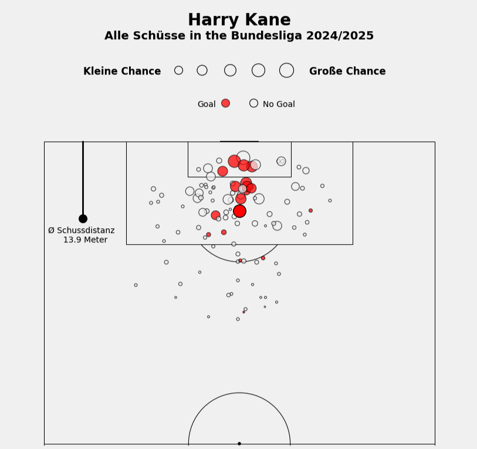

# 📊 Schuss-Map Visualisierung im Fußball

Dieses Projekt bietet eine visuelle Darstellung von Schüssen im Fußballspiel mithilfe von Python und Matplotlib. 
Ziel ist es, Positionsdaten von Schüssen grafisch auf einem Fußballfeld darzustellen – etwa für Analyse, Scouting oder Präsentationen.

## 📒 Inhalt des Notebooks

Das Jupyter Notebook `Schuss-Map_Visualisierung.ipynb` umfasst folgende Schritte:

- 📥 Einlesen und Vorverarbeitung von Schussdaten (z. B. aus CSV-Dateien)
- ⚽️ Erstellung eines stilisierten Fußballfelds mit `matplotlib`
- 🎯 Plotten einzelner Schüsse nach Position, xG und Torerfolg

## 🛠️ Anforderungen

Folgende Python-Bibliotheken werden verwendet:

- `matplotlib`
- `pandas`
- `numpy`

## 📊 Beispielergebnis
Als Beispiel hier die Schuss-Map von Harry Kane aus der Saison 2024/2025:

